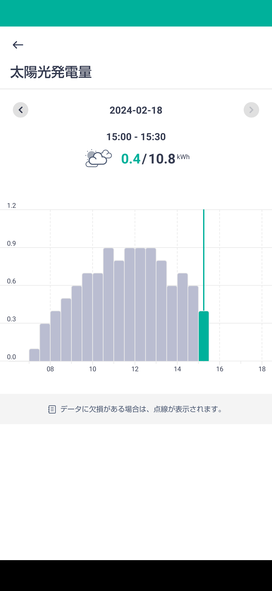
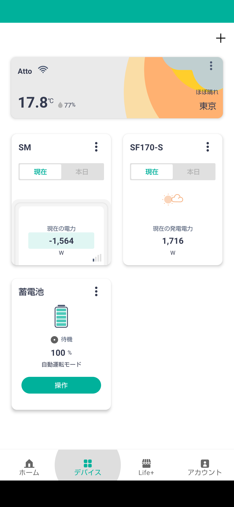
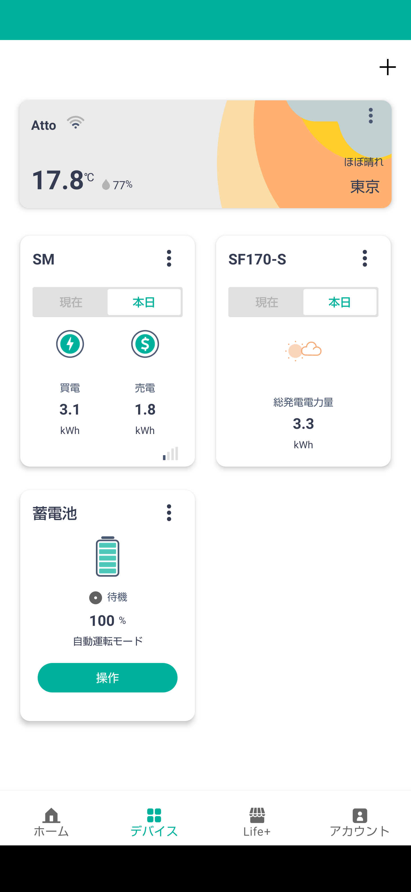

# sfgw
ソーラーフロンティアモニター ECHONET Lite PVプロファイル対応ゲートウェイ
====================================

ECHONET Lite 住宅用太陽光発電プロファイルに対応させた中継機能です。  
ECHONET Liteに対応したHEMS等に表示させることが出来るようになります。  
<https://echonet.jp/wp/wp-content/uploads/pdf/General/Standard/AIF/pv/pv_aif_ver1.20.pdf>

* (E0)瞬時発電電力計測値 ⇒宅内ホームサーバより直接取得
* (E1)積算発電電力量計測値 ⇒フロンティアモニターサイトより取得  
<https://www.frontier-monitor.com/persite/top>

## Usage

# 実行環境  
* Python3  
** py3-requests

# 接続環境設定  
SFCfg.pyのログインID、パスワード、ホームサーバーアドレスを設定します。
<pre>
#フロンティアモニターログイン情報
USERID = 'ログインＩＤ'
PASSWD = 'パスワード'

#フロンティアホームサーバのIPアドレス
SFMON_ADDR = '192.168.0.xxx'
</pre>
※ホームサーバやルータの設定でIPアドレス固定にしておくと良いです。

# 実行例  
<pre>
$ python3 SFPvGw.py
</pre>
※Windowsで関連付けされている場合、ダブルクリックでもOK

------------------------------------------------
WindowsでのPythonインストール例  
* Microsoft ストア版 
<https://apps.microsoft.com/detail/9NRWMJP3717K?ocid=pdpshare&hl=ja-jp&gl=JP>
<pre>
$ pip install requests
</pre>

------------------------------------------------
HEMS atto(Nextdrive社製)での利用例

